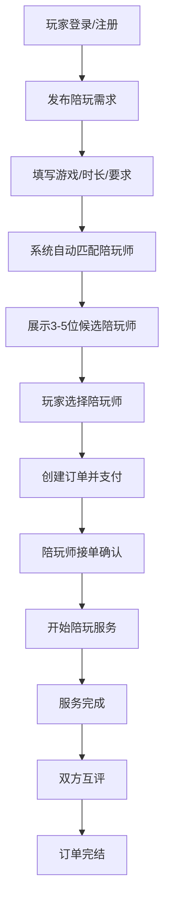

## 1. 产品概述

游戏陪玩接单系统是一个连接游戏玩家与专业陪玩师的在线服务平台。玩家可发布游戏陪玩需求，系统自动匹配符合条件的陪玩师供玩家选择，双方达成订单后进行服务，完成后进行评价打分。

- 核心目标：解决玩家寻找优质陪玩的痛点，为陪玩师提供稳定接单渠道
- 目标用户：游戏玩家（需求方）、游戏陪玩师（服务提供方）
- 市场价值：连接供需两端，建立信任评价体系，打造高质量游戏社交平台

## 2. 核心功能

### 2.1 用户角色

| 角色 | 注册方式 | 核心权限 |
|------|---------|---------|
| 玩家 | 手机号/用户名注册 | 发布需求、浏览陪玩师、下单、支付、评价 |
| 陪玩师 | 提交资质审核注册 | 完善个人资料、接收匹配、接单、服务、查看评价 |

### 2.2 功能模块

1. **首页/大厅**：导航栏、热门陪玩师推荐、游戏分类、需求发布入口
2. **陪玩师注册页**：个人信息填写、游戏技能认证、服务价格设置、上传展示
3. **玩家下单页**：选择游戏、设置时长要求、描述需求、预算设置
4. **陪玩师匹配页**：系统推荐匹配列表、陪玩师详情、在线状态、选择确认
5. **订单管理页**：订单列表、订单详情、订单状态流转、支付操作
6. **评价系统页**：评分打分、文字评价、评价展示

### 2.3 页面详情

| 页面名称 | 模块名称 | 功能描述 |
|---------|---------|---------|
| 首页 | 导航栏 | Logo、角色切换（玩家/陪玩师）、登录注册入口、订单中心 |
| 首页 | 英雄区 | 平台标语、快速发布需求CTA按钮、数据展示 |
| 首页 | 游戏分类 | 热门游戏图标列表，点击筛选对应陪玩师 |
| 首页 | 热门陪玩师 | 卡片式展示高分陪玩师，头像、评分、游戏、价格 |
| 陪玩师注册 | 基本信息 | 昵称、头像、性别、年龄、简介填写 |
| 陪玩师注册 | 游戏技能 | 选择擅长游戏、段位/等级认证、每小时价格设置 |
| 陪玩师注册 | 服务时段 | 设置可接单时间段、服务说明 |
| 玩家下单 | 游戏选择 | 游戏类型下拉选择、服务器/区服填写 |
| 玩家下单 | 时长设置 | 选择游戏时长（1h/2h/3h/自定义）、具体时间段 |
| 玩家下单 | 需求描述 | 语音要求、技术要求、其他备注说明 |
| 陪玩师匹配 | 匹配列表 | 系统根据条件推荐3-5位符合条件的陪玩师 |
| 陪玩师匹配 | 陪玩师卡片 | 头像、昵称、评分、接单量、游戏段位、价格、在线状态 |
| 陪玩师匹配 | 详情查看 | 点击展开查看详细资料、历史评价、服务记录 |
| 订单管理 | 订单列表 | 待支付/进行中/已完成/已取消分类Tab |
| 订单管理 | 订单详情 | 订单信息、陪玩师信息、状态时间线、操作按钮 |
| 评价系统 | 评分组件 | 1-5星评分、分项评分（技术/服务/态度） |
| 评价系统 | 评价内容 | 文字评价输入、标签快捷选择、提交评价 |
| 评价系统 | 评价展示 | 历史评价列表、评分统计、好评率展示 |

## 3. 核心流程

玩家发布游戏陪玩需求后，系统根据游戏类型、段位要求、时间段等条件自动匹配符合要求的陪玩师，展示3-5位候选人供玩家选择。玩家确认选择后创建订单并支付，陪玩师开始服务，服务完成后双方进行评价。

## 4. 用户界面设计

### 4.1 设计风格

- **主色调**：深紫蓝渐变 (#1a1a2e → #16213e) 搭配霓虹青色 (#00fff5) 和品红 (#ff006e) 作为强调色
- **副色调**：深灰色卡片背景 (#252542)，白色文字 (#ffffff)，次要文字 (#a0a0c0)
- **按钮风格**：霓虹发光边框按钮，圆角8px，悬浮时有辉光扩散动画
- **字体**：标题使用 'Orbitron' 科幻字体，正文使用 'Rajdhani' 现代无衬线字体
- **布局风格**：暗黑游戏风格，玻璃拟态卡片，赛博朋克霓虹灯光效果
- **图标风格**：线性霓虹图标，使用 emoji 增强游戏感（🎮 🕹️ ⭐ 💬 🔥）

### 4.2 页面设计概述

| 页面名称 | 模块名称 | UI元素 |
|---------|---------|-------|
| 首页 | 英雄区 | 全屏渐变背景，霓虹标题，发光CTA按钮，浮动粒子动画 |
| 首页 | 游戏分类 | 横向滚动卡片，游戏图标悬浮放大，霓虹边框高亮 |
| 首页 | 热门陪玩师 | 网格布局卡片，玻璃拟态效果，头像光晕，评分星星动画 |
| 陪玩师注册 | 表单 | 深色输入框，霓虹聚焦边框，步进式进度指示器 |
| 玩家下单 | 表单 | 分段控件选择时长，滑块选择预算，标签快捷选择 |
| 陪玩师匹配 | 列表 | 竖向卡片列表，匹配度百分比进度条，脉冲在线状态指示 |
| 订单管理 | 列表 | Tab切换分类，时间线状态展示，操作按钮组 |
| 评价系统 | 评分 | 交互式星星评分，标签云选择，文字计数器 |

### 4.3 响应式设计

- 采用桌面优先设计（Desktop-first），主内容区最大宽度1440px
- 平板端（≤1024px）：侧边栏收起，卡片网格从3列调整为2列
- 移动端（≤768px）：导航汉堡菜单，卡片单列布局，表单全宽显示
- 触摸优化：所有可点击元素最小44x44px，按钮增加触摸反馈

### 4.4 动效与交互

- 页面加载：元素从下往上渐入，延迟错峰动画
- 卡片悬浮：轻微上浮 + 霓虹边框发光增强
- 按钮交互：点击时霓虹光脉冲扩散
- 匹配列表：逐个滑入动画，匹配度进度条从0填充动画
- 评分星星：鼠标悬停时星星依次点亮
