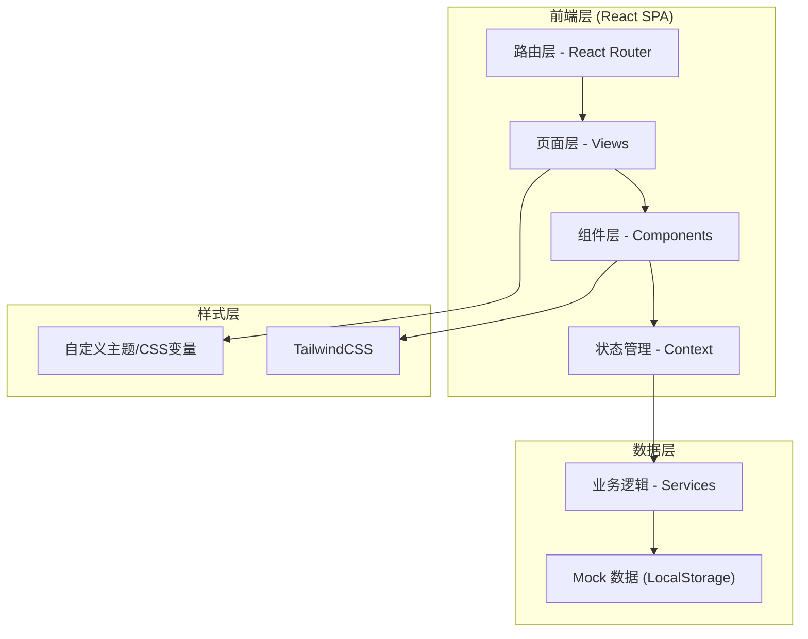
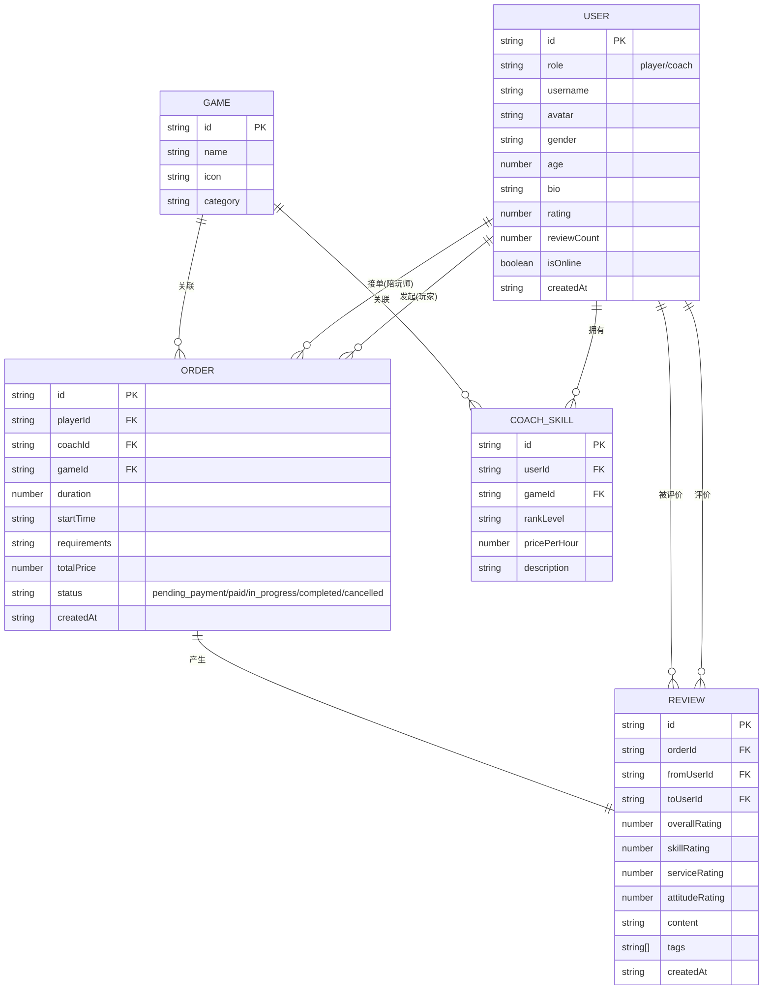

## 1. 架构设计



## 2. 技术描述

- **前端框架**: React@18 + TypeScript
- **构建工具**: Vite@5
- **样式方案**: TailwindCSS@3 + CSS变量主题
- **路由管理**: React Router@6
- **状态管理**: React Context + useReducer
- **图标库**: Lucide React
- **数据存储**: LocalStorage + Mock数据（无需后端）
- **动画方案**: CSS Transitions + TailwindCSS动画类

## 3. 路由定义

| 路由路径 | 页面名称 | 用途说明 |
|---------|---------|---------|
| / | 首页大厅 | 平台介绍、游戏分类、热门陪玩师推荐 |
| /register/player | 玩家注册 | 玩家账号注册页面 |
| /register/coach | 陪玩师注册 | 陪玩师资质注册与资料完善 |
| /order/create | 创建订单 | 玩家填写陪玩需求发布页面 |
| /order/match | 陪玩师匹配 | 系统匹配结果展示与选择页面 |
| /orders | 订单列表 | 订单管理中心（全部状态Tab） |
| /orders/:id | 订单详情 | 单个订单详情与状态追踪 |
| /orders/:id/review | 评价页面 | 服务完成后的评价打分页面 |
| /coaches | 陪玩师列表 | 浏览所有陪玩师 |
| /coaches/:id | 陪玩师详情 | 陪玩师个人资料与评价展示 |

## 4. 数据模型

### 4.1 实体关系图



### 4.2 TypeScript 类型定义

```typescript
// 用户类型
type UserRole = 'player' | 'coach';

interface User {
  id: string;
  role: UserRole;
  username: string;
  avatar: string;
  gender: 'male' | 'female' | 'other';
  age: number;
  bio: string;
  rating: number;
  reviewCount: number;
  isOnline: boolean;
  createdAt: string;
}

// 陪玩技能
interface CoachSkill {
  id: string;
  userId: string;
  gameId: string;
  rankLevel: string;
  pricePerHour: number;
  description: string;
}

// 游戏
interface Game {
  id: string;
  name: string;
  icon: string;
  category: string;
}

// 订单状态
type OrderStatus = 'pending_payment' | 'paid' | 'in_progress' | 'completed' | 'cancelled';

interface Order {
  id: string;
  playerId: string;
  coachId: string;
  gameId: string;
  duration: number;
  startTime: string;
  requirements: string;
  totalPrice: number;
  status: OrderStatus;
  createdAt: string;
}

// 评价
interface Review {
  id: string;
  orderId: string;
  fromUserId: string;
  toUserId: string;
  overallRating: number;
  skillRating: number;
  serviceRating: number;
  attitudeRating: number;
  content: string;
  tags: string[];
  createdAt: string;
}
```

## 5. Mock 数据设计

- **初始用户**: 5-8位预设陪玩师（各游戏类型覆盖）、1位测试玩家
- **游戏列表**: 8-10款热门游戏（王者荣耀、英雄联盟、和平精英、原神等）
- **陪玩技能**: 每位陪玩师关联1-3个游戏技能
- **历史订单**: 5-10条模拟订单数据
- **评价数据**: 与历史订单对应的评价记录

## 6. 核心组件结构

```
src/
├── components/
│   ├── common/
│   │   ├── Navbar.tsx          # 导航栏
│   │   ├── Button.tsx          # 霓虹按钮
│   │   ├── StarRating.tsx      # 星星评分
│   │   ├── Card.tsx            # 玻璃拟态卡片
│   │   └── Modal.tsx           # 弹窗组件
│   ├── coach/
│   │   ├── CoachCard.tsx       # 陪玩师卡片
│   │   ├── CoachList.tsx       # 陪玩师列表
│   │   └── CoachDetail.tsx     # 陪玩师详情
│   ├── order/
│   │   ├── OrderCard.tsx       # 订单卡片
│   │   ├── OrderTimeline.tsx   # 订单状态时间线
│   │   ├── MatchCard.tsx       # 匹配结果卡片
│   │   └── ReviewForm.tsx      # 评价表单
│   └── form/
│       ├── PlayerRegisterForm.tsx
│       ├── CoachRegisterForm.tsx
│       └── CreateOrderForm.tsx
├── pages/
│   ├── HomePage.tsx
│   ├── PlayerRegisterPage.tsx
│   ├── CoachRegisterPage.tsx
│   ├── CreateOrderPage.tsx
│   ├── MatchPage.tsx
│   ├── OrderListPage.tsx
│   ├── OrderDetailPage.tsx
│   ├── ReviewPage.tsx
│   └── CoachListPage.tsx
├── context/
│   ├── UserContext.tsx
│   └── OrderContext.tsx
├── data/
│   └── mockData.ts
├── types/
│   └── index.ts
├── utils/
│   └── helpers.ts
├── App.tsx
├── main.tsx
└── index.css
```

## 7. 目录结构

项目采用标准 React + Vite 项目结构，按功能模块组织代码，便于维护和扩展。
